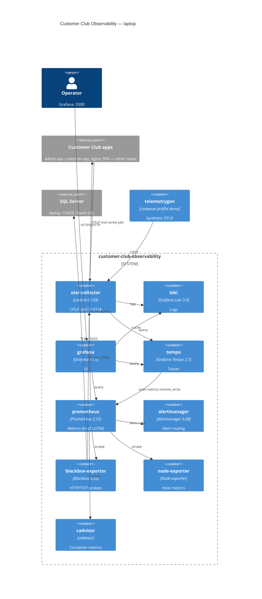

# Architecture

This repository is the **observability platform** (Grafana LGTM + OpenTelemetry).
It is not the application backend or frontend.

Laptop / lab = one Docker Compose project on a single host. Production can split
the same pieces across an Edge host and a Trust host (see below).

## C4 container diagram

Printable file: [customer-club-observability-containers.pdf](./customer-club-observability-containers.pdf)

HTML source used to render the PDF: [container-diagram.html](./container-diagram.html)

## What LGTM means here

| Letter | Product in *this* repo | Notes |
|--------|------------------------|--------|
| L | Loki | Logs |
| G | Grafana | UI on host port **3300** (3000 is customer-nginx) |
| T | Tempo | Traces |
| M | **Prometheus** | Grafana’s scaled-out M is Mimir. Not used on this laptop. |

The OpenTelemetry Collector sits in front of LGTM. Apps never send to Loki/Tempo/Grafana directly.

## Inventory

### In this Compose project

| Component | Status | Role | Laptop port |
|-----------|--------|------|-------------|
| Loki | Has | Log store | 3100 |
| Grafana | Has | UI, Explore, one stack-health dashboard | 3300 |
| Tempo | Has | Trace store + span-metrics | 3200 |
| Prometheus | Has | Metrics (stands in for Mimir) | 9090 |
| otel-collector | Has | OTLP intake, PII filter, routing | 4317 / 4318 / 9464 |
| Alertmanager | Has | Alert routing UI — no external webhook yet | 9093 |
| blackbox-exporter | Has | HTTP/TCP probes of the apps | internal |
| node-exporter | Has | Host CPU / disk / memory | internal |
| cAdvisor | Has | Container metrics | internal |
| telemetrygen ×3 | Has (`--demo`) | Synthetic traces / metrics / logs | — |

### Intentionally not here

| Component | Why |
|-----------|-----|
| Mimir | Multi-cluster metrics. Prometheus is enough for Compose. |
| Distributed Tempo / Loki | Single-binary is the laptop and first prod shape. |
| Pyroscope | CPU profiling — later, not required for LGTM. |
| Grafana Alloy | Chose CNCF `otel-collector-contrib` instead. |
| Seq / Elasticsearch | Replaced by Loki + OTLP. |
| .NET / Vue instrumentation | Lives in `customer-club-api` / `customer-club`. |

### Target production layout, not built in this compose yet

| Component | Notes |
|-----------|--------|
| sql-exporter | SQL wait stats, deadlocks, index DMVs |
| Edge collector (second agent) | Laptop uses one collector; Edge needs a forwarder |
| nginx log scrape + `/otel/` RUM path | App / nginx config |
| RED dashboards for APIs / login / nginx | Only `grafana/dashboards/stack-health.json` exists |
| Real alert channels | Email / SMS / on-call webhook |
| Grafana OnCall | Alertmanager UI only |

## Production split (same images, two hosts)

| Host | Runs |
|------|------|
| Edge (`EDGE_IP`) | `customer-nginx`, `customer-web`, **otel-collector-edge** (not in this compose yet) |
| Trust (`TRUST_IP`) | APIs, admin stack, **this LGTM compose** (gateway collector + storage + Grafana) |
| SQL | Never scraped from Edge; sql-exporter would sit on Trust |

Grafana / Loki / Tempo / Prometheus must not be published through the WAF.

## Signal path

1. App or `telemetrygen` → OTLP → `otel-collector`
2. Collector deletes `otp` / `password` / `access_token` / `national_id`, then:
   - traces → Tempo
   - logs → Loki `:3100/otlp`
   - metrics → Prometheus exporter `:9464`
3. Prometheus scrapes collector, Tempo span-metrics (remote write), node-exporter, cAdvisor, blackbox
4. Alert rules in `config/prometheus-alerts.yml` → Alertmanager
5. Grafana joins on `trace_id`

## Files

| Path | Purpose |
|------|---------|
| `docker-compose.yml` | All platform containers |
| `config/otel-collector.yml` | Receive OTLP → Tempo / Loki / Prometheus |
| `config/prometheus-alerts.yml` | First P0/P1 rules |
| `grafana/provisioning/` | Datasources + dashboard auto-load |
| `docs/container-diagram.html` | Source for the PDF |
| `docs/customer-club-observability-containers.pdf` | Printable C4 container diagram + inventory |
| `docs/render-container-pdf.sh` | Regenerates the PDF with Chrome |
| `cc-obs.sh` | `up` / `down` / `smoke` — does not `source` `.env` |
